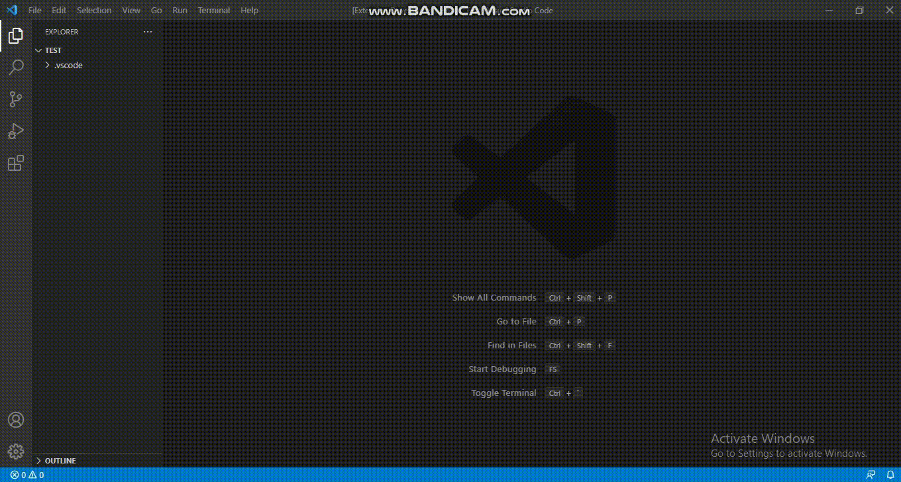

# Kanban Board

A simple Kanban Board for Visual Studio Code.

## Features

* Create task
* drag and drop (change status of the task)
* delete task

## Using the Extension

The extension will automatically create the kanban board when you use.  Just press `ctrl+shift+P` and then type `Kanban Board` and press `Enter` to open the Kanban Board in Visual Studio code.

## Contributions

Contibutions to the project was most welcome.  Please read `CONTRIBUTING.md` to know more on contributing to the project.

## Contributors

